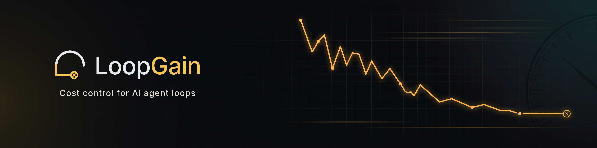

<div align="center">



AI agent loops waste time and money when they don't know when to stop. LoopGain measures the loop in real time and stops it the moment it has actually converged — and rolls back before it degrades — instead of running to a fixed `max_iterations` cap.

**[loopgain.ai](https://loopgain.ai)** · **[Benchmarks](https://loopgain.ai/benchmarks)** · **[Dashboard](https://dashboard.loopgain.ai)** · **[PyPI](https://pypi.org/project/loopgain/)**

</div>

---

## The problem

Verify-revise loops — agentic coding, self-refinement, ReAct — have no real stopping signal, so they run to a guessed `max_iterations`. Set it too low and you cut the loop off before it's done. Set it too high and you burn tokens and wall-clock on iterations that aren't improving anything — or, worse, that quietly degrade a correct answer back into a broken one. `max_iterations=N` is just a guess, and the loop has no idea which iteration was its best.

## What LoopGain does

LoopGain watches each loop's error trajectory and classifies it live into five named states — `FAST_CONVERGE`, `CONVERGING`, `STALLING`, `OSCILLATING`, `DIVERGING` — then acts on that signal:

- **Stops** the loop once it has converged, instead of running out the cap.
- **Rolls back** to the best-so-far iteration before a loop degrades a good result.
- **Estimates** remaining iterations live, exposed as `lg.eta`.

Under the hood it's a **Barkhausen-criterion (`Aβ`) stability classifier** — the same loop-gain test that decides whether any feedback system converges or oscillates, applied to an LLM agent loop instead of an amplifier. That's the *how*; the outcome is less spend and faster loops.

```python
pip install loopgain
```

```python
import loopgain as lg

# wrap your existing verify-revise loop — framework-agnostic
monitor = lg.Monitor()
for step in agent_loop():
    state = monitor.observe(step.error)
    if state.should_stop:
        break          # converged, or rolled back to best-so-far
```

## The numbers

Measured across a public benchmark of **2,000 paired real-API trials** (8,000 runs), versus a fixed `max_iterations=20` baseline:

| Metric | Result |
|---|---|
| Cost | **93.5% reduction** ($27.61 → $1.80; **$25.81 saved** per trial) |
| Wall-clock | **~10× faster** (median 93.0s → 9.8s) |
| Quality | preserved on the natural distribution; improved on engineered-failure cases |

Full protocol, raw data, and the cases where it *doesn't* help are public: **[loopgain-bench](https://github.com/loopgain-ai/loopgain-bench)**.

> **Scope, honestly:** LoopGain proves a loop *stopped moving* and recovers the best iteration it saw — it does not by itself prove the loop stopped at the *correct* answer. It's a cost-and-stability control on the loop, not a correctness oracle.

## Works with your stack

Six first-class adapters plus the raw API — framework- and model-agnostic, never tied to one provider:

**LangGraph** · **CrewAI** · **AutoGen** · **LangChain** · **OpenAI Agents SDK** · **Claude Agent SDK**

## Open-core

- **`loopgain`** — the library. **Apache-2.0**, free, self-hostable. [PyPI](https://pypi.org/project/loopgain/) · [source](https://github.com/loopgain-ai/loopgain)
- **Hosted dashboard + telemetry** — paid SaaS for fleet-wide loop observability and alerting. [dashboard.loopgain.ai](https://dashboard.loopgain.ai)

Source is open; hosting and ops are paid. Run it entirely yourself, or let us run the dashboard.

---

<div align="center">

**[loopgain.ai](https://loopgain.ai)** · [@LoopGainAI](https://x.com/LoopGainAI) · [LinkedIn](https://www.linkedin.com/company/loopgain-ai) · [hello@loopgain.ai](mailto:hello@loopgain.ai)

</div>
